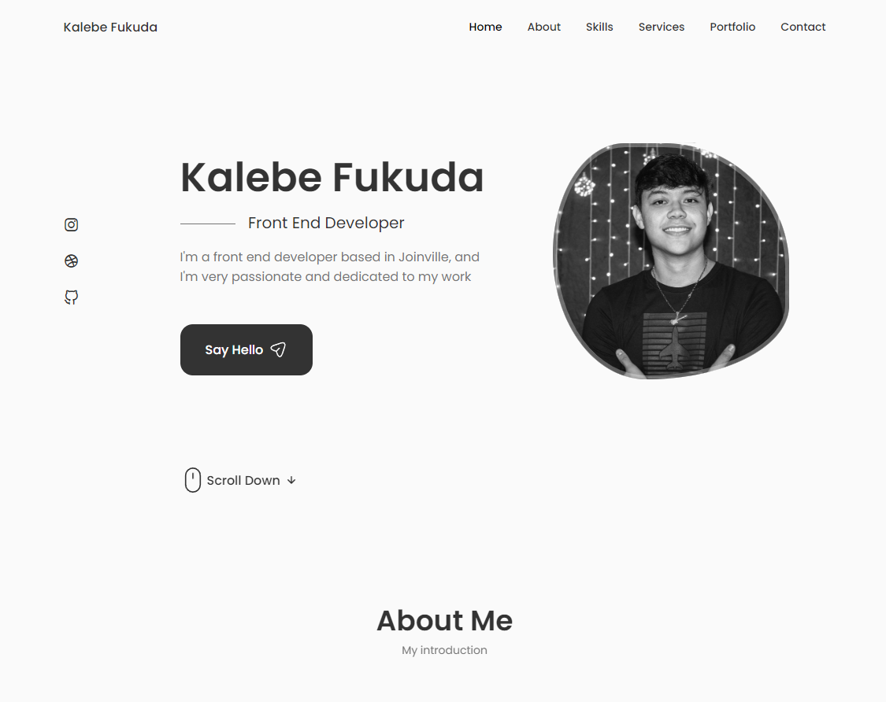

# MyPortfolio
<h1 align="center"> MyPortfolio </h1>

Projeto desenvolvido para fins de aprendizado  

  <a href="#-tecnologias">Tecnologias</a>&nbsp;&nbsp;&nbsp;|&nbsp;&nbsp;&nbsp;
  <a href="#-projeto">Projeto</a>&nbsp;&nbsp;&nbsp;|&nbsp;&nbsp;&nbsp;
  <a href="#memo-licença">Licença</a>

  

 

## 🚀 Tecnologias

Esse projeto foi desenvolvido com as seguintes tecnologias:

* HTML e CSS
* JavaScript
* Git e Github
* React JS

## 💻 Projeto

Neste projeto apresento um pouco sobre mim, por meio de um portfolio.

##  Licença

Esse projeto está sob a licença MIT.

